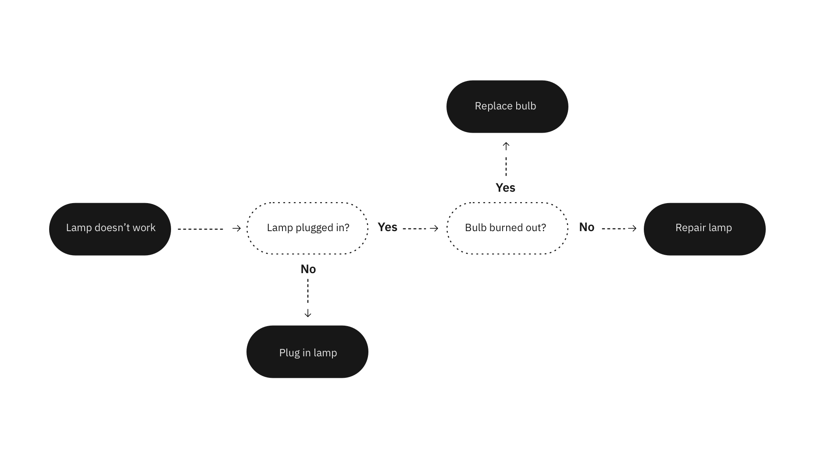

import { AnchorLinks, PageDescription } from "gatsby-theme-carbon";

<PageDescription>

  These are technical guides for non-technical people. Whether you’ve found yourself in need of knowing AI or have always been curious to learn more, this will teach you enough to dive deeper into the vast and deep AI ocean.

  Inspired by Reddit’s “Explain Like I’m 5,” these succinctly break down complicated topics without relying on technical jargon.

</PageDescription>

Read time | *5 mins*

## What is artificial intelligence?

Any system capable of simulating human intelligence and thought processes is said to have “Artificial Intelligence” (AI). 

Science fiction has done a fantastic job at warning us what's to come once machines are able to think as well as humans. Fortunately, the AIs often depicted in movies are far more advanced than what technology is capable of today (or any time soon, for that matter).

While these aspirational systems — called artificial general intelligence — are far off, there's a lot of deserved buzz around artificial narrow intelligence, or weak AI. Narrow AI focuses on one, narrow task of human intelligence, and within it, there are two branches: rule-based AI and example based AI. The former involves giving the machine rules to follow while the latter giving it examples to learn from (see machine learning). 

AI takes many forms, like [machine learning](/basics/ml), computer vision, natural language processing, robotics, etc. Consequently, the term “AI” is increasingly used as shorthand to describe any machines that mimic our cognitive functions such as "learning" and "problem solving”.

The safest working definition is the study of making systems capable of simulating human intelligence and thought processes, which comes in many forms.

_Note: This guide makes comparisons to human intelligence to make it easier to understand the basic concepts of machine cognition. Organic thought is obviously different from artificial thought, both technically and philosophically, but philosophy is not the purpose of this document. Our goal is to equip provide the most digestible practical explanation of AI._

## Why use AI?

AI can achieve higher quality outcomes faster than humanly possible. 

Today, AI is most often used to recognize patterns, make predictions, and provide insights previously out of reach due to the sheer amount of available data. It’s able to do this because, unlike traditional computer technologies, AI is able to learn from examples as opposed to being explicitly programmed to execute specific instructions.

These systems are meant to augment our own intelligence and maximize our confidence. In a growing number of fields, AI is serving as a companion for professionals to enhance performance and reduce the time required to become an expert. It will aid in the pursuit of knowledge, to further our expertise, and to improve the human condition. 

##### Common AI use cases
AI is a powerful toolbox that has many applications in domains far and wide. The types of problems that the AI toolbox is best equipped to solve can be split into six core intents:

 1. Accelerate research and discovery
 2. Enrich your interactions
 3. Anticipate and preempt disruptions
 4. Recommend with confidence
 5. Scale expertise and learning
 6. Detect liabilities and mitigate risk

##### Read more about these on [IBM’s Watson site](https://www.ibm.com/watson/about).

Some of the most common tasks AI performs — and their corresponding subfields — include:
 - Extracting information from pictures (computer vision)
 - Transcribing or understanding spoken words (speech to text and natural language processing)
 - Pulling insights and patterns out of written text (natural language understanding)
 - Speaking what's been written (text to speech, natural language processing)
 - Autonomously moving through spaces based on its senses (robotics)
 - Generally looking for patterns in heaps of data (machine learning)

## How does AI work?
It depends on several factors.


Each of AI tasks mentioned has its own unique implementation, but it can be boiled down to roughly two approaches: specifying the rules that solve the problem versus giving the machine examples to find the pattern on its own.

##### Rules based
The rules-based approach uses algorithms — a sequence of unambiguous instructions used by computers to solve problems. It tells a computer precisely what steps to take to solve a problem or reach a goal. The chosen algorithm(s) determine how the AI will "think" about surfacing insights to address your problem space. Different algorithms have different goals, strengths, and weaknesses.  Choosing the right fit depends on your desired outcome and the

##### Examples based
The examples-based approach uses data to create models. 

This data can take many forms: music, videos, weather conditions, user profiles, system logs, etc. Models are the result of training an AI on data to find patterns. This is akin to you studying before a big exam — you started with little to no understanding, so you ingested a bunch of study material so that you could go out into the world ready to apply your new knowledge. This way of problem solving is largely made possible by its subfield, machine learning. 

This is helpful in cases where specifying rigid rules (i.e. writing algorithms) is hard or abundant e.g. in stock trading, identifying cancer, predicting which video a user wants to see next, etc. 

Some helpful people at MIT created a flowchart that guides you through whether or not the thing you're looking at is, in fact, AI. You can find it here.

##### See for yourself
 - [Watson Assistant](https://www.ibm.com/cloud/watson-assistant/)
 - [This person does not exist](https://thispersondoesnotexist.com/)
 - [Boston Dynamics robotics](https://www.youtube.com/watch?v=tf7IEVTDjng)
