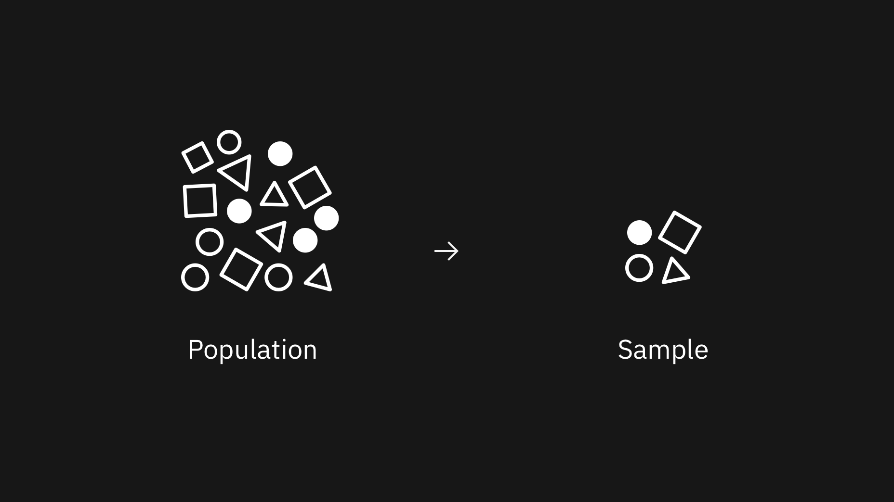

<PageDescription>

  These are technical guides for non-technical people. Whether you’ve found yourself in need of knowing AI or have always been curious to learn more, this will teach you enough to dive deeper into the vast and deep AI ocean. The purpose of these explanations is to succinctly break down complicated topics without relying on technical jargon.

</PageDescription>

## What is data?

*Data is the fuel that powers artificial intelligence.* Despite being critical to the AI equation, data often gets overlooked or minimized—often at enormous costs. It takes hard work to get data to the point where it’s usable for AI, but ultimately it comes down to hitting two big checkboxes: quantity and quality.

Before taking the AI plunge, you need to have the right data and enough of it. This includes acquiring data, cleaning it, filling in the gaps, and in a majority of cases taking additional steps to render it useful. Those familiar with [Rob Thomas' AI Ladder](https://video.cube365.net/c/910697) will note that this takes place in the "Collect" and "Organize" steps.

What follows are several of the key considerations with respect to collecting and using data.

## Data collection
#### Sampling

Sampling helps ensure your dataset matches the real world and that a given sliver of data is as representative of the whole as possible.

Generally, in statistics and machine learning (ML), we want to know as much as possible about a certain population — a specific set of people with shared characteristics that make them interesting to us (e.g. new homebuyers in Montana, Yankee fans outside of New York, etc.).

In an ideal world, we’d survey each and every individual in that population, or the majority of them. In the real world, that’s expensive, tedious, and sometimes impossible. Instead, data collectors try to select a sliver of the population that best represents the population as a whole. It could look something like this.

<Row>
<Column colLg={12}>

<Caption fullWidth>
  Needs a caption
</Caption>
</Column>
</Row>

Assuming you could only pick four people, that’s probably the closest you could get to representing the population. Naturally, as the sample size grows closer to the population size, your sample characteristics will be closer to the true characteristics of the whole.

In cases where the data wasn't properly sampled, you'll almost certainly come to the wrong conclusions about your population as a whole, meaning you're not giving your users what they need. Assuming that's the case, it’s irreparable and unable to reconcile without going out and getting more data about your population.

#### (Ease of) Acquiring data

This is knowing what it takes to actually get the data. Data can take multiple different forms. Sometimes it's in a database, sometimes it's in a filing cabinet, sometimes it's scattered across someone's desk. Some data is proprietary and some is public domain. Sometimes someone is positive that it exists, they just have to go find it.

Wrangling data across disparate sources can take a substantial amount of time, and more so if it requires generating or digitizing the data.

#### Data completeness

Data completeness indicates whether all the data that you need is available in your data resources and ensuring your data doesn’t have gaps.

If you buy a dozen eggs for a recipe, you don’t want to get home and find that you're missing one. If you’re working with a large dataset — even with millions of records — you don’t want to find that your data has gaps or that certain fields are missing.

In a contrived example, suppose you're making a mood tracker and you import a table that looks like the one below. Your data doesn’t tell you how John felt on Tuesday. In the real world, data specialists can sometimes fill gaps like this, though it isn’t easy. Sometimes it renders the data unusable, requiring you to throw it out.

| Day     | John's Mood |
| ------- | ----------  |
| Sunday  | Good        |
| Monday  |             |
| Tuesday | Bad         |

## Data organization
#### Consolidating data

You have your mountain of data pulled from several different piles digitized and sitting in front of you, now what? Likely it'll need to be combined and put in a single place, formatted a specific way. At this step you have to put all of your data in one place and make it work together.

For example, let's say you are trying to create a simple program to track your mood over time, along with the weather. Your journal entries are in a spreadsheet that you can export as a comma-separated value file (or .csv file). The weather data exists, but you'll have to use an API of some sort to pull it and pair it with your journal entries. Even though both piles of data exist and exist digitally, there is still work to pull them together in one place.

#### Consistent data

Training an AI is akin to training a toddler. That toddler's knowledge is dependent on you being consistent in your teaching. For example, you can't expect your toddler to ever master arithmetic if you say 1+1=2 and also teach 1+1=3 at the same time. You can expect the same out of your system. Ultimately this is making sure all of your data is saying the same thing.

#### Data richness

Data richness is when the quality of the data paints a vivid picture. This means that you have enough data to get to the essence of what's really going on. It's finding the necessary data points to ensure that you're not conflating correlation with causation. Without data rich enough to describe the nature of your problem and environment, you run the risk of your AI missing the real connection.

For example, let's take a famous ice cream sales and murder rate correlation. An increase of ice cream sales is shown to coincide with an increase in homicides. If we left our observation there, we might try to — naively — ban the sale of ice cream. Of course we'd have no success, considering how these occurrences are only correlated; the missing variable being temperature, as ice cream sales and murder rates spike in hotter temperatures.

## Data collection and organization
#### De-biased or bias transparent data

This concern is one that needs to be top of mind, so that your AI doesn’t optimize inequity. Bias — prejudice in favor of or against one thing, person, or group compared with another — can be introduced at many stages of the process. If we choose an unrepresentative sample, it skews the dataset in favor of the overrepresented. During the data entry, subjective, and often qualitative, fields are subject to the user's interpretation, e.g. assessing how you feel on a day to day basis. Annotation, or tagging and labeling the data with pertinent information, brings with it the lenses each annotator sees the world through.

It's worth noting explicitly right now, that even assuming data purity and removing all bias from it — which in many cases is nothing short of impossible — machine learning by its very nature is always a form of statistical discrimination.

## Takeaway
When we get in our car, we think of the destination, rarely what's needed to get us there. Insights are the destination, data is the fuel. Consequently, before you set off on your AI journey, be mindful of what it takes to acquire enough useful and de-biased data.

Even though it's important to plan for where we want to land, it's equally important to understand how to get there. Data is one half of the AI equation, and requires conscious consideration.
