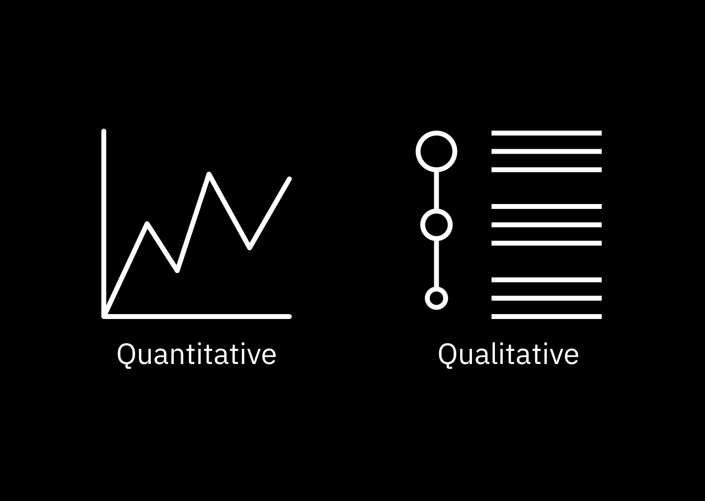
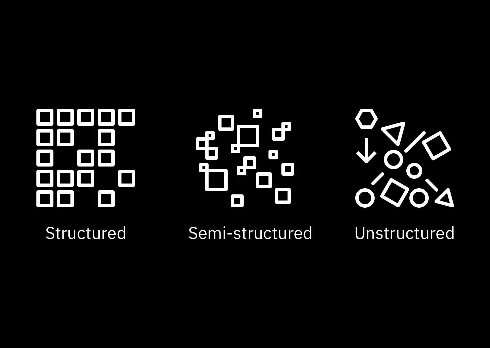
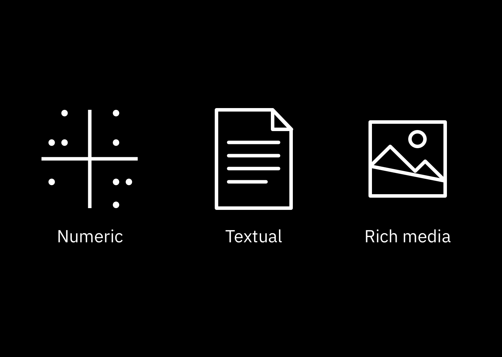
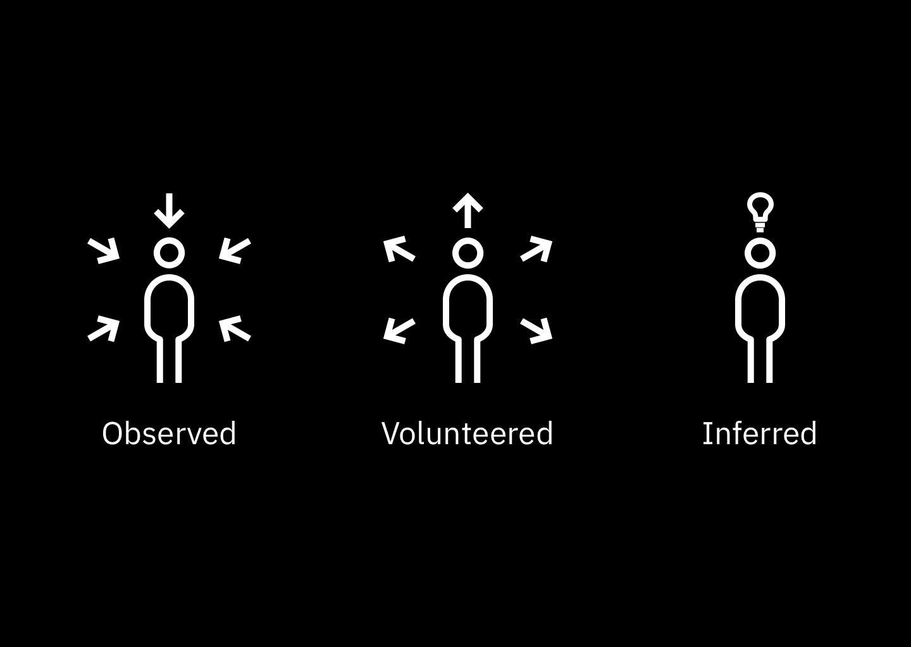
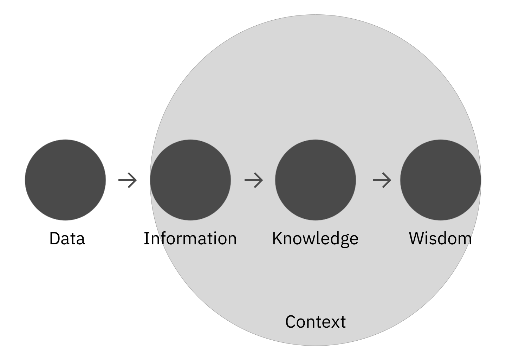

<PageDescription>

  These are technical guides for non-technical people. Whether you’ve found yourself in need of knowing AI or have always been curious to learn more, this will teach you enough to dive deeper into the vast and deep AI ocean. The purpose of these explanations is to succinctly break down complicated topics without relying on technical jargon.

</PageDescription>

## What is data?
*da·ta* | ˈdadə, ˈdādə | _noun_

1. the quantities, characters, or symbols on which operations are performed by a computer
1. facts and statistics collected together for reference or analysis.

_Simply put, data is a recorded snapshot of anything that has happened or is happening._ This manifests in countless ways: visualizing sales data, the nutrition data on our food, the data withheld in the pages of a book, data representing foot traffic through a city, data returned from developer APIs. These images exhibit the complexity of data, generally bound by human creativity and ingenuity. If it can be captured, it’s considered data.

Data encompasses a lot. However, there are ways to describe it that places it in neat boxes.

### Zooming in
To begin to unpack data’s nuances, we can think of data as having different attributes:

- Nature
- Shape
- Format
- Origin

#### Attribute 1: Nature
One of the first things that most data practitioners take stock of is the nature of their data. In other words, whether their data is quantitative or qualitative.

Quantitative data represents measurable things, such as average inches of rainfall per year in New York City, and is usually recorded numerically. Qualitative data, on the other hand, is usually recorded with symbols or words and describes qualities or characteristics. User experience interviews are an examples of qualitative data.

Sometimes the same idea can be conveyed by either quantitative data or qualitative data.  For example, the temperature outside is 40℃ (104°F) versus “Hot” or 🥵.

By combining both kinds of data, you can begin to see a fuller picture of the phenomena you are measuring. Consider you’re looking at the weather where you’ll be going on vacation. With quantitative data, you can know what the average highs, lows, and wind speed are, while qualitative data would tell you what that weather feels like. Whereas qualitative data would say that 13℃ (55°F) and 40 km/h (25 mph), qualitative data would tell you it’s chilly.

#### Attribute 2: Shape
Another characteristic of data is shape. If the data is organized and follows a predictable pattern with strict rules, it’s called structured data. If the data doesn’t cohere to a discernible pattern, that data is unstructured. (There’s also a hybrid of the two, called semi-structured.)

It’s helpful to think of the difference between these two types of data as literal shapes. If you can easily fit your data into a rectangular grid with well-defined columns and rows, it’s likely structured (e.g. spreadsheets). If it doesn’t easily fall into columns and rows, such as a text document, it’s probably unstructured. If it loosely conforms to a pattern that you could make into a grid, like Yelp reviews, Wikipedia pages, or Tweets, it’s probably semi-structured.

#### Attribute 3: Format
Data practitioners should know how their data is represented. This boils down to a few options:

- Numeric
- Textual
- Media (Images, Videos, Audio)
- Hybrid

The easiest way to ascertain the format of your data is to simply look at it. If you see numbers, it’s numeric; if you see primarily words, it’s textual. In more advanced cases, your data are media, such as images, videos, or audio files. Sometimes, a dataset can capture media, textual, and numeric data, such as web pages.

When tackling media data, the photos/videos/audio is usually transformed into numeric data so computers can digest them. An example is breaking down a photograph into a grid of RGB (red-blue-green) values.

#### Attribute 4: Origin
Lastly, there is the question of how the data was created. The answer to this usually falls into three categories: observed, volunteered, and inferred.

Observed data are when a person or machine records a phenomenon. Researchers performing use interviews and machines logging website clickthrough rates are examples. Volunteered data are self-reported and/or explicitly shared with data collectors by individuals. An example of volunteered data is anything shared on social networks. Inferred data are data based on the analysis of volunteered and/or observed information, such as credit scores.

As you move from observed data towards inferred data, subjectivity starts to creep in. More on this in the Data Decrees.

### Data in context — The Understanding Continuum
Many companies pride themselves on being data-driven. Leaders in the field have adopted data to make better business decisions; yet, for most companies, data hasn’t yielded much change in business outcomes. (citation needed). This is because many people are focusing on data rather than the what data enables: knowledge and wisdom.

In order to understand this distinction, it’s helpful to reflect on Nathan Shedroff’s Understanding Continuum[4]. It serves as a blueprint to “Wisdom,” described as the future-facing application of acquired knowledge. While data, information, and even knowledge is useful, its usefulness is linked to the human problem it solves.

<Caption fullWidth>
DIKW model, ©1994 Nathan Shedroff
</Caption>

Suppose you want to know what to wear outside. The data are the disparate temperatures recorded, various locations, the times of the day. (This is among a plethora of other figures semi- or unrelated to the problem; we this call noise.) Information is the organized data, associating temperatures with locations and time of day. It’s more useful, but not by much. (I doubt you care about last year’s forecast or what the weather is halfway across the world when you’re planning what to wear.) Knowledge begins to cement understanding by seeing the patterns latent in the data and information. (You might observe that it’s typically cold in the morning and gets warm by the afternoon.) Wisdom is knowing the best course of action based on acquired knowledge and experiences. (You would conclude that instead of wearing a sweater to wear a light jacket; it’s easier to remove and because it serves as a better shield from the wind chill.)

Your end-users rarely care about data. They want it to work; work better, work faster, work more reliably. Creating solutions that achieve user and business outcomes requires understanding data in the context of the problem you're solving.

## Takeaway

Data come in many shapes and sizes with some types better equipped to solve certain problems. Leveraging the right data for the job can give you a better picture of the world around you. However, raw data is seldom useful. When data is processed, organized, or presented in a given context, it becomes useful to us and the decisions we need to make.
