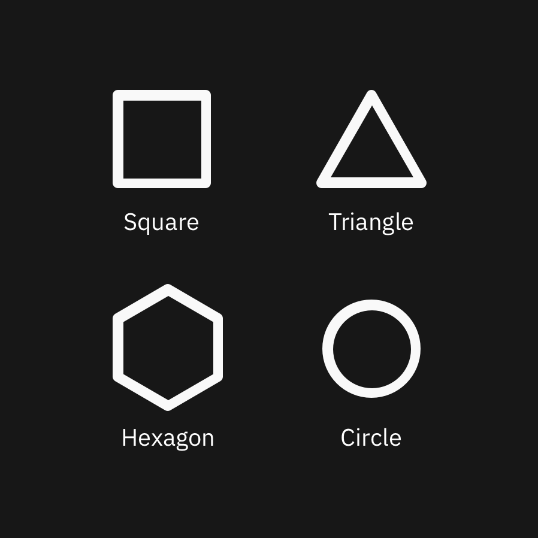
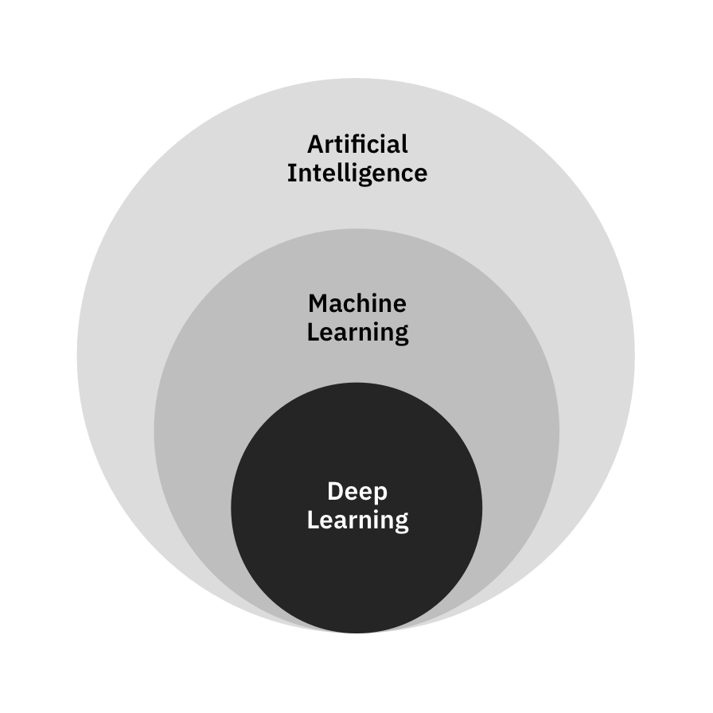

<PageDescription>

  These are technical guides for non-technical people. Whether you’ve found yourself in need of knowing AI or have always been curious to learn more, this will teach you enough to dive deeper into the vast and deep AI ocean.

  Inspired by Reddit’s “Explain Like I’m 5,” these succinctly break down complicated topics without relying on technical jargon.

</PageDescription>

## What is machine learning?

Machine learning (ML) is a subset of artificial intelligence (AI), that is all about getting an AI to accomplish tasks without being given specific instructions. In essence, it's about teaching machines how to learn!

AI is simulated human cognition, so let's first think about how we learn. Here's a simple question: were we born with PhD level intelligence?

Of course not! At the beginning of our lives, we have little understanding of the world around us, but over time we grow to learn a lot. We use our senses to take in data, and learn via a combination of interacting with the world around us, being explicitly taught certain things by others, finding patterns over time, and, of course, lots of trial-and-error. 

AI learns in a similar way. When it’s first created, an AI knows nothing; ML gives AI the ability to learn about its world.

_Note: This guide makes comparisons to human intelligence to make it easier to understand the basic concepts of machine cognition. Organic thought is obviously different from artificial thought, both technically and philosophically, but philosophy is not the purpose of this document. Our goal is to equip provide the most digestible practical explanation of AI._

## Why use machine learning?

AI is all about allowing a system to learn from examples rather than instructions. ML is what makes that possible.

AIs are taught, not explicitly programmed. In other words, instead of spelling out specific rules to solve a problem, we give them examples of what they will encounter in the real world and let them find the patterns themselves. Allowing machines to find patterns is beneficial over spelling out the instructions when the instructions are hard or unknown or when the data has many different variables, for example treating cancer, predicting the stock market.

<Row>
<Column colSm={4} colMd={8} colLg={12}>

</Column>
</Row>

## How does machine learning work?

There are a few distinct ways that machines can learn. In most cases, it'll fall under one of three buckets: supervised learning, unsupervised learning, and reinforcement learning. 

Remember that we as humans also have discrete learning styles. Sometimes we learn by watching videos and reading books; other times we acquire knowledge based on hearing it in context. There are also learning certain tasks that require a specific learning style. For example, we can always read about baseball, but if we want to hit a ball, there's no amount of reading that can substitute practicing swinging a bat. This separation in learning styles is the basic idea behind the different branches of ML.

#### Supervised learning
Supervised learning specializes in predicting the future. This is split further depending on whether it's predicting a thing or a number, called classification or regression, respectively. To understand how this works, you start with the data. All supervised learning algorithms need what’s called labeled data. This data is grouped into samples that have been tagged with one or more labels. In other words, applying supervised learning requires you to tell your model 1. what the key characteristics of a thing are (called features); and 2. what that thing actually is. 

To demonstrate the former, let's take the example of teaching a child their shapes. This is classification problem and starts by giving the child a shapes sheet, which shows shapes and the shape’s corresponding name. 

<Row>
<Column colLg={6}>

</Column>
</Row>

Circles are simple enough. Every circle is perfectly round (with infinite sides); this pieces of information is the key feature of a circle.

Triangles are a little more complex. Based on the shapes sheet, your child might assume that all triangles have equal-length sides. In order for your child to better understand triangles, you'd have to show her or him more examples. Doing this would build their confidence in identifying triangular shapes.

<Row>
<Column colLg={6}>

</Column>
</Row>

After consuming these additional examples, your child would learn that the key feature of a triangle is having three sides, but also that those sides can be of varying lengths, unlike the square.

Now let’s consider the other type of supervised learning: predicting a value. Let’s say you're trying to predict how much your salary should be. Assume you could see everyone else’s pay, along with their roles, experience, responsibilities, band level, and other relevant information. You could then use this data to see whose situations are closest to yours (ie. people with similar roles, experience, responsibilities, etc.), and determine what your salary range should look like based on what those folks are being paid. This is called a regression problem.

In a nutshell, supervised learning is about providing your AI with enough examples to make accurate predictions.

#### Unsupervised learning
Unsupervised learning finds commonalities and patterns in the input data on its own. By extension, it's also commonly used to find outliers and anomalies in a dataset. Most unsupervised learning focuses on clustering—that is, grouping the data by some set of characteristics or features. This is the same “features” mentioned in supervised learning, although unsupervised learning doesn't use labeled data.

Let’s use the example again of the child and the shapes. Suppose again that you had a child group similar shapes together (Figure 3). The child will likely group, (or cluster), by shape, color, or size. This mode of learning is great for surfacing hidden connections or oddities in oceans of data.

<Row>
<Column colLg={12}>

</Column>
</Row>

#### Reinforcement learning
Reinforcement learning is about rewarding positive behavior and punishing negative behavior. Over time, this can help your AI determine the optimal behavior for a particular environment or situation. 

Think back to your childhood. When you were at school or at home, what happened when you did something bad? You probably got scolded, grounded, or a long lecture. What happened when you did something good?  Maybe you got praise or gifts. Rewarding the "right" behavior and punishing the "wrong" behavior is the cornerstone of reinforcement learning; that is you give your agent positive reinforcement for doing the right thing and negative reinforcement for the wrong things. 

The ingredients of a reinforcement learning problem are: 
 - an agent, 
 - its environment, 
 - a way for the agent to interact with its environment, and 
 - a way for the agent to get feedback on its actions within the environment (called a reward function or feedback function).

ML isn't magic; it's math. Statistics, probability, linear algebra, and algorithms are what bring ML to life.

#### Deep learning and neural networks
Deep learning (DL) is a subset of machine learning, therefore everything you just learned still applies. The motivation is still trying to predict an output given a set of inputs, and either supervised learning or unsupervised learning can be used. The key differences are performance and how it works. 

For now, just know that deep learning is machine learning that uses a neural network with multiple hidden layers. If you want to even more, read [this] or watch [that].

<Row>
<Column colLg={6}>

</Column>
</Row>

DL is uniquely suited for making deep connections within the data because of neural networks. Neural networks come in many shapes and sizes, but are essential for making deep learning work. They take an input, and perform several rounds of math on its features for each layer, until it predicts an output. (Deep breath, the rules of ML still apply.) DL uses a specific subset of NN in order to work.

The caveat to NN are that in order to be powerful, they need a lot of data and take a long time to train, thus can be expensive comparatively. Also because the human allows the machine to find deeper connections in the data, the process is near non-understandable and not very transparent.

Some notable examples include the deep-fake videos, restoring black and white photos, self driving cars, video games AIs, and sophisticated robotics (e.g. Boston Dynamics). 

## ML in the real world 

#### Visual recognition 
Despite seeing pictures on screens all the time, it's surprising to know that machines had no clue what it was looking at until recently. Developments in ML has enabled us to supply pictures of, for example, a cat and over time, machines will begin to discern which pictures have cats in them from data it hasn't seen yet. 

#### Cancer treatment
When it comes to diagnosing and treating cancer, there are innumerable variables to account for. ML can look through historical patient records and treatment plans to suggest treatment plans for the current patient, thereby expediting the process dramatically.

#### User leaving your product
No one wants to see a user go. Luckily in many cases, a user will demonstrate patterns indicative of an eminent departure. ML can classify a user's behavior as one that will likely leave soon.

#### Stock market predictions
People are deathly serious about their money, especially when it's their job. Those in the financial industry are always looking for a way to stay competitive and ahead of the curve. With decades of stock market data to pore over, companies have invested in having an AI determine what to do now based on the trends in the market its seen before. To buy or to sell — a classification problem. How much will this stock be valued tomorrow, a regression problem.

## See for yourself
 - [Watson Personality Insights Demo](https://personality-insights-demo.ng.bluemix.net/)
 - [Watson Natural Language Understanding](https://natural-language-understanding-demo.ng.bluemix.net/)
 - [MIT Deepmoji](https://deepmoji.mit.edu/)
 - [A visual introduction to machine learning](http://www.r2d3.us/visual-intro-to-machine-learning-part-1/)
