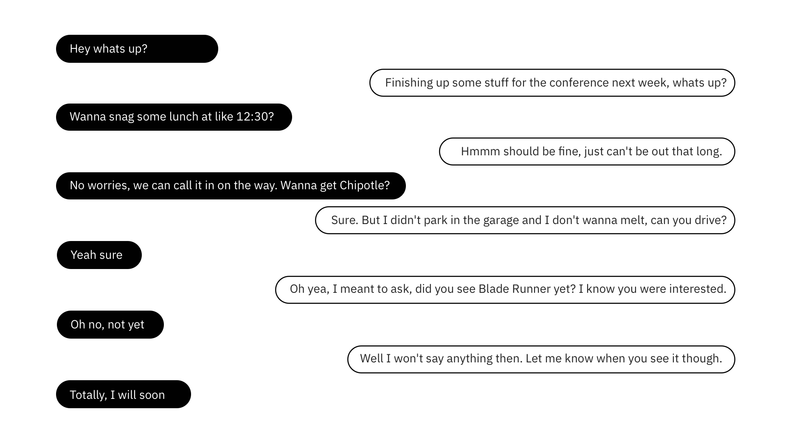

<PageDescription>

  Now that machines, powered by analytics and cognitive capabilities, can technically understand, reason, learn and interact using natural language, what will they say when designers give them a voice?

</PageDescription>

<AnchorLinks>
  <AnchorLink>Introduction</AnchorLink>
  <AnchorLink>Chatbots and conversational agents</AnchorLink>
  <AnchorLink>Chatbot and agent uses</AnchorLink>
  <AnchorLink>What is conversation?</AnchorLink>
  <AnchorLink>Crafting effective conversation</AnchorLink>
  <AnchorLink>How does a bot interpret conversation?</AnchorLink>
  <AnchorLink>The heart of a relationship</AnchorLink>
</AnchorLinks>

## Introduction
Whereas traditional speech recognition systems understand what people say, today’s sophisticated natural language systems understand what people *mean*. These technical feats are no doubt impressive, but there's much work to be done to make these systems communicate seamlessly and naturally. Moreover, even when a conversational agent is up front about its limitations, many users will hold it to human expectations.

Conversational experiences must walk a fine line: humans expect a bot have human attributes (such as empathy, curiosity, humor, compassion, and patience) while maintaining the transparency of being a machine.

## Chatbots and conversational agents
There is a difference between a *chatbot* and a *conversational agent*. Chatbots and conversational agents each serve a unique purpose. When someone mentions a "chatbot" there is a possibility they may be referring to either of these types of conversational tech unknowingly. Consider the needs and goals of your users before determining the best approach. 

#### Chatbots 
Chatbots aren’t new. In fact, they've been around since the 1960s. If you've had a conversation with a computer, you've most likely interacted with a chatbot. Their scope is narrow, limited and predefined. This is great for simple scenarios like checking an account balance or getting a weather update. Chatbots are purely assistive—they help users with a set of finite tasks. These can take the form of voice assistants (Alexa, Siri, Google Home), traditional chatbots (messaging apps), or a mix of both. 

#### Conversational agents 
These take chatbots a step further by not only informing users but by assisting them as well. They can take agency and are backed by intelligence. For example, consider a conversational system that not only assists in informing tourists about travel destinations, but will also help to book their flights/hotel/travel for them.

## Chatbot and agent uses
For the sake of simplicity, we will be referring to both chatbots and conversational agents as “bots” going forward. Successful bots must augment capabilities and expertise, while also being an extension of the brands they represent. Bots have some clear uses including:

#### Natural language and understanding
Bots have the ability to engage in realistic conversation with users. The bot will be able to understand the user's messages and context to provide responses that are relevant and useful.

#### Engagement and personalization
Bots can provide personalization at scale. They can help companies automate one-on-one communications with their customers and personalize those communications using customer information and by asking meaningful questions to understand a customer's intent. Bots with properly designed personalities can build emotional connections between customers and brands to increase engagement.

#### Integration and growth
Bots are omni-channel. Successful bots won't be standalone applications, but rather a set of common tools that operate like a central cognitive brain. These can be deployed across all of the channels consumers use – messaging, mobile, phone systems, web, and social media. You won't have to roll out entirely new versions of a bot in order to constantly update the content and they can be trained on the fly based off real user data.

#### Scalability and consistency
A bot allows you to own the conversation and the dialog for every engagement and make that interaction available 24/7. You can offload questions that don’t require human interference for an instant response.

#### Education and entertainment
Bots are great for educating users on topics that are relevant to a brand, product or conversation topic. Bots also are diverse enough to entertain the user with games, natural conversation, or other forms of interaction.

#### Intelligent authentication and security
Voice biometrics allows consumers to easily and naturally authenticate their identity without having to type in a password or PIN by simply speaking a short passphrase. Voice biometrics significantly improves security over legacy authentication methods and prevents fraud.

## What is conversation?

Since conversation is the bedrock foundation of meaningful relationships, a bot must be capable of holding an intelligent, two-way conversation. As social beings, we converse every day without giving it a second thought and our discourse is natural and autonomic. We tend to take that flow for granted. To utilize conversational technology to its full, game-changing potential, we must be consciously aware of how we communicate. By understanding how we communicate with each other we can begin to replicate this with a machine.

For our intents and purposes, conversation is the meaningful exchange of ideas and information between two or more individuals. The requisite parts of a conversation are topics, exchanges, and utterances.

#### Topics
Topics provide context. They are the high-level subjects of a conversation at any given point.

#### Exchanges
Exchanges communicate information. An exchange consists of two or more utterances. Everything said within an exchange is relevant to either the topic or previous messaging. Without this correlation, there is no basis for understanding one another in conversation.

#### Utterances
Utterances are the individual statements articulated in an exchange and the building blocks for all conversation. These expressions are the atomic, single turns within an exchange. Here is an example conversation that we can identify topics, exchanges, and utterances within.

## Example Conversation
<Row>
<Column colSm={4} colMd={4} colLg={6}>

</Column>
</Row>

## Crafting effective conversation
Keep in mind that a bot will only provide one half of the conversation. It could be initiating an exchange, or providing a response. You won’t be able to control the user’s end of a conversation. Your job, as a designer, is to provide a delightful conversational experience to the user using a bot as the medium. The key is developing your bot in a way that, no matter the utterance, the bot sounds natural and provides a believable response.

#### Preferred Responses
To provide a realistic conversation for your users, your bot must be relevant. A tacit expectation exists at the heart of every conversation. When we speak with someone else, we're expecting a response that is relevant to the topic at hand, whether it's what we want to hear or not. Yet, conversations go a bit deeper than that. We subconciously hope for a specific, expected response. This is what we call a *preferred response*. The same goes for responses we hope we don’t receive, aka non-preferred responses.

Understanding what your users may view as preferred responses, then maximizing for them in conversation is key to natural, positive conversations. Another key is to develop satisfying, informative non-preferred responses that don’t come across as negative or stilted to the user. These are aspects of conversations that we, as humans, find to be the most rewarding. Many small, rewarding interactions like these can help to build relationships over time with a bot.

#### Relevancy
In general, we expect a response of some kind when making an utterance. At the bare minimum, we expect something back that is relevant to our initial utterance. This is how we anchor our conversations; we aren’t just shouting random utterances at each other.

It’s most thrilling when we feel that a bot "understands" us. In a bot’s case, that means being stateful and contextually aware of the topic at hand. It’s critical for your bot to make the user feel understood while also maintaining relevancy.

#### Repair
Bots should be able to elegantly fail in nearly all situations. It's crucial for a bot to provide authentic and relevant acknowledgement to a user when failure occurs. It's okay for the bot to be wrong, but it's not okay for it to be wrong and irrelevant. This will immediately take users out of the moment and will degrade perception of the bot’s abilities. It also comes across as unnatural. The ability for a bot to jump across multiple topics of discussion, handle harassment, recognize when an utterance is irrelevant or nonsense, or just get back on topic is critical. Part of the designer’s job is to identify where and when conversation could get messy and account for it beforehand.

## How does a bot interpret conversation?
A bot interprets our conversation digitally by identifying the intents and entities in our utterances, which in turn will give it the information it needs to craft a proper response.

#### Intents
An intents is the action or purpose behind an utterance. These are generally verbs.

For example, in the utterance: “I’d like to order some tacos and beer,” the intent would be *to order*. In the utterance: “Where is the bathroom?” the intent is *to find*.

#### Entities
An entity is an object that was mentioned in the utterance that is relevant to the user’s intent. These are generally nouns. By recognizing the entities that are mentioned in the user's input, the bot can choose the proper response.

For example, in the utterance: “I’d like to order some tacos and beer”. The entities would be *tacos* (food) and *beer* (drink).

## The heart of a relationship
We’re still figuring out what human/AI relationships look like, but if they look anything like our human/human relationships, conversations are essential. It takes two to grow a relationship, and it takes understanding the inherent strengths of humans and machines to design for a relationship between the two.  We must understand how and why we forge relationships with each other and why we’d be willing to invest in a relationship with something new and foreign to many of us. Designing conversations requires us to know ourselves better than ever before.
