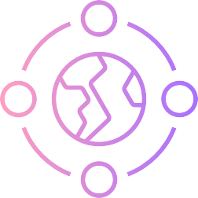
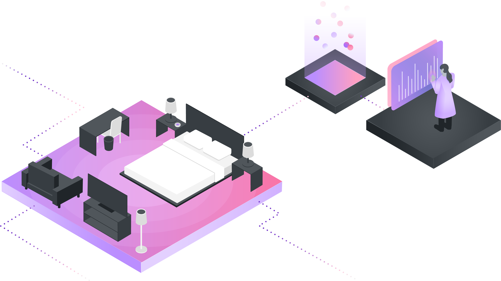

import { Aside, Column, Row } from "gatsby-theme-carbon";
import './ethics.scss';

<Row className="opener">
<Column colSm={4} colMd={6} colLg={7}>

### AI must be designed to minimize bias and promote inclusive representation.

### AI provides deeper insight into our personal lives when interacting with our sensitive data. As humans are inherently vulnerable to biases, and are responsible for building AI, there are chances for human bias to be embedded in the systems we create. It is the role of a responsible team to minimize algorithmic bias through ongoing research and data collection which is representative of a diverse population.

</Column>

<Column colSm={4} offsetLg={1} colMd={2} colLg={2}>

</Column>
</Row>

<Row>
<Column colSm={4}>

## Recommended actions

</Column>
<Column className={'recommendation'} colMd={4} colLg={4}>

**01** 
Real-time analysis of AI brings to light both intentional and
unintentional biases. When bias in data becomes apparent, the
team must investigate and understand where it originated and how
it can be mitigated.

</Column>
<Column className={'recommendation'} colMd={4} colLg={4}>

**02** 
Design and develop without intentional biases and schedule team
reviews to avoid unintentional biases. Unintentional biases can
include stereotyping, confirmation bias, and sunk cost bias.

</Column>
</Row>

<Row className={'recommended'}>
<Column className={'recommendation'} colMd={4} colLg={4}>

**03** 
Instill a feedback mechanism or open dialogue with users to raise awareness of user-identified biases or issues. e.g. *[Woebot](https://woebot.io)* asks “Let me know what you think,” after suggesting a link.

</Column>
</Row>

<Row className="consider">
<Column colMd={7} colLg={7}>

## To consider

 - Diverse teams help to represent a wider variation of experiences
 to minimize bias. Embrace team members of different ages,
 ethnicities, genders, educational disciplines, and cultural
 perspectives.
 - Your AI may be susceptible to different types of bias based on
 the type of data it ingests. Monitor training and results in
 order to quickly respond to issues. Test early and often.

</Column>

<Column colSm={4} colMd={4} offsetLg={1} colLg={3}>
<Aside className={'quote'}>

_“By progressing new ethical frameworks for AI and thinking critically about the quality of our datasets and how humans perceive and work with AI, we can accelerate the [AI] field in a way that will benefit everyone. IBM believes that [AI] actually holds the keys to mitigating bias out of AI systems – and offers an unprecedented opportunity to shed light on the existing biases we hold as humans.“_

**[Bias in AI: How we Build Fair AI Systems and Less-Biased Humans](https://www.ibm.com/blogs/policy/bias-in-ai/)**

</Aside>
</Column>
</Row>

<Row className="questions">
<Column colMd={7} colLg={7}>

## Questions for your team

 - How can we identify and audit unintentional biases that we run
 into during the design and development of our AI?
 - The status quo changes over time. How do we instill methods to
 reflect that change in our ongoing data collection?
 - How do we best collect feedback from users in order to correct
 unintentional bias in design or decision-making?

</Column>
</Row>

<Row className="example">
<Column colMd={7} colLg={7}>

## Fairness example

 - After sitting down with members of the hotel’s global
 management, the team uncovers that diversity and inclusiveness
 are important elements to the hotel’s values. As a result, the
 team ensures that the data collected about a user's race,
 gender, etc. in combination with their usage of the AI, will not
 be used to market to or exclude certain demographics.
 - The team inherited a set of data about guests from the hotel.
 After analyzing this data and implementing it into a build of
 the agent, they realize that it has a degree of algorithmic bias
 from the data. The team proceeds to take the time to train the
 model further on a bigger, more diverse set of data.

</Column>
</Row>

