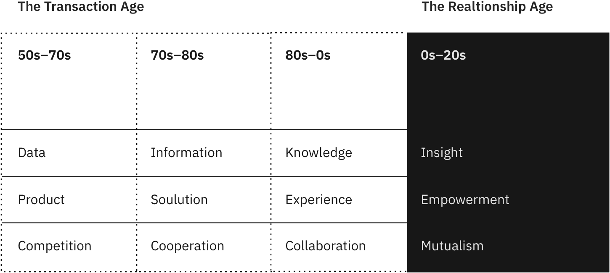
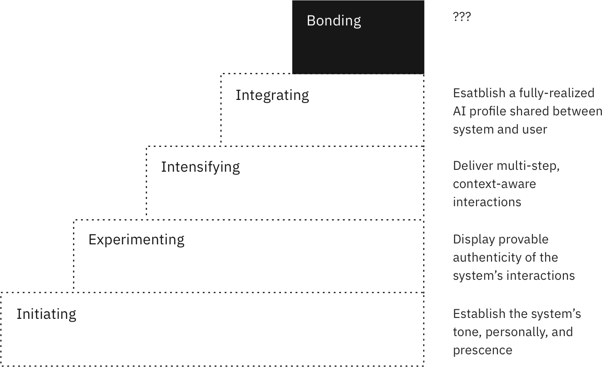
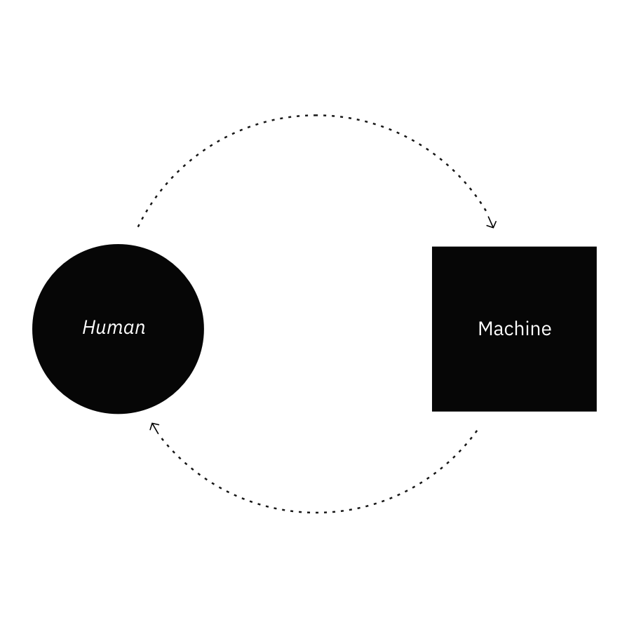
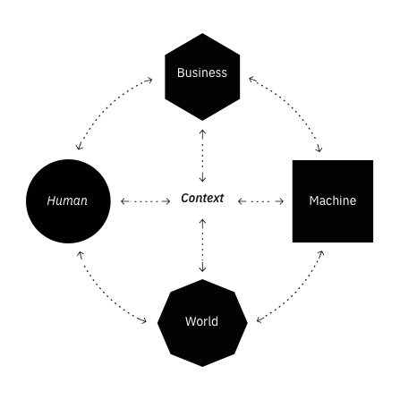
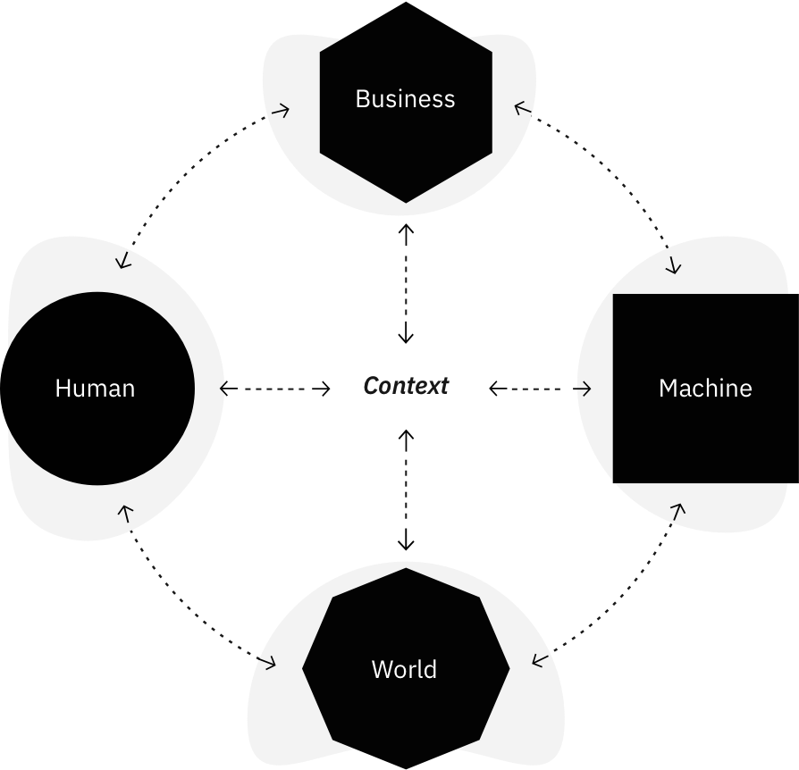
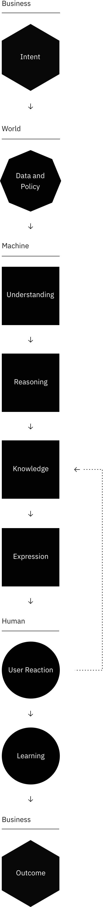
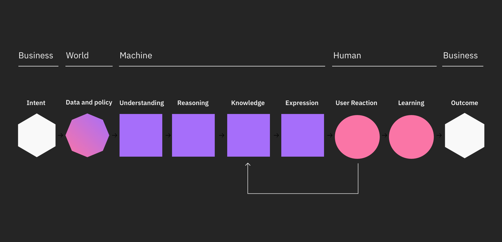

<PageDescription>

Artificial intelligence (AI) is a mystery and a wonder. It can help us solve humanity's most difficult problems. AI is also vastly misunderstood by most people. For some, AI is a magical black box with the intelligence of a PhD. It knows all about everything, you just bring your problems and, *voilá*, your problems are solved. For others, fears of AI uprisings, loss of human control and Terminator-like scenarios cloud their capability to understand the present utility of cognitive computing.

</PageDescription>

<AnchorLinks>
  <AnchorLink>Introduction</AnchorLink>
  <AnchorLink>AI Design Foundations</AnchorLink>
  <AnchorLink>Purpose, Value, and Trust</AnchorLink>
  <AnchorLink>Characteristics for AI</AnchorLink>
  <AnchorLink>Design Factors or AI</AnchorLink>
  <AnchorLink>AI Ecosystem</AnchorLink>
  <AnchorLink>AI/Human Context Model</AnchorLink>
  <AnchorLink>Questions for Your Team</AnchorLink>
</AnchorLinks>

## Introduction

When looking for ways to apply this cutting-edge, revolutionary technology, AI can not only dazzle, but can blind us as well. The more buzz and hype, the greater the pressure becomes to rush to create something using whatever new capabilities are presented to us. The benefit of moments like this is the opportunity to discover, experiment, and learn.

We must focus our design talents upon a new type relationship with machines - machines that can draw from vast stores of human knowledge, hold a conversation, and increase human understanding. What should these relationships look like? Designing for AI requires new considerations and new ways of thinking.

When we find ourselves in such unfamiliar territory, the best way to begin is by reminding ourselves of the true purpose for any innovation: to improve the quality of human life.

Consider what we’ve learned living through the past few major technological innovations. The internet brought the world’s information to our beck and call and taught us that whatever we want, whenever we want it is always a finger-length away. Mobile tech enabled humanity to take that information with us at all times. Social computing and messaging changed the foundations of how we communicate with each other and language itself.

Each innovation provided a new context for communication and expanded (or changed) our understanding of the relationships we have with machines. AI requires us to take notice of new contexts yet again. This time, designers must account for a system that can understand, reason, learn, and interact.

As a result, this changes the nature of our design considerations, some of which we take for granted based on the last 40+ years of software design. If we’ve moved past typing into a text field and pressing “submit,” what does it mean to design for human/machine relationships?

## AI Design Foundations

As [Jared Spool] (https://twitter.com/jmspool/status/967730832482938880?lang=en) says, **design is the rendering of intent.** This intent drives our outcomes. It’s the “why” behind what we do and the cause for us to affect change. Intentions require us to identify purposes and values for our efforts. Outcomes require going beyond ideas and create meaningful, trusted solutions for the people we serve.

Design is more than a job or role—it’s an essential part of what makes us human. **The value of design is to improve lives and leave the world better than we found it.** When designing for AI, our core intents are always rendered through the following lenses:

<Row>
<Column colLg={4}>

#### Purpose
The reason for the user to engage with the system. This will evolve as the user and system grow with each other.

</Column>

<Column colLg={4}>

#### Value
The augmented capabilities provided by the system that tangibly improves a user’s life.

</Column>
</Row>

<Row>
<Column colLg={4}>

#### Trust
The willingness of a user to invest in an emotional bond with the system. This trust is predicated on security of the system’s data, the feeling of human control, and the quality of the results the system provides.

</Column>
</Row>

## Characteristics of AI
AI is the simulation of human thought processes in a computerized model. AI involves self-learning systems that use data mining, pattern recognition and natural language processing to **mimic the way the human brain works.**

These systems learn at scale, reason with purpose and interact with humans naturally. What search is to information retrieval, AI is to better, more-informed decision-making. In short, they help human experts make better decisions. We characterize AI as having four main qualities:

<Row>
<Column colLg={4}>

#### Understands
AI deeply understands its domain. It does this primarily through data – structured and unstructured, text-based or sensory – in context and meaning, at speed and volume.

</Column>

<Column colLg={4}>

#### Reasons
AI reasons towards specific goals. It has the ability to form hypotheses by making considered arguments and prioritized recommendations to help humans make better decisions.

</Column>
</Row>

<Row>
<Column colLg={4}>

#### Learns
AI learns continuously through experience. In ingests and accumulates data and insight from every interaction at all times. **It is trained, not programmed**, by experts who enhance, scale and accelerate their expertise. Therefore, these systems get better over time.

</Column>

<Column colLg={4}>

#### Interacts
AI interacts naturally with people and systems. The interaction model of an AI is expected to flow unobtrusively while continuously building a sustainable relationship between itself and its users.

</Column>
</Row>

## Design Factors for AI
When it comes to designing for AI, our focus must be unwavering in providing experiences that put the user above all else.

AI isn’t about data, it’s about insights. Data is the fuel for the car, insights are the destinations. This is what people care about.

AI is capable of delivering more human-like interactions with people — based on the mode, form, and quality each person prefers. It reasons through the sum total of structured and unstructured data to find what really matters but this isn’t the full picture. **Our solutions must primarily address user needs instead of being force-fit to accommodate technical capabilities or requirements.**

<Row>
<Column colLg={12}>

<Caption fullWidth>
  MutualMarketing human dynamics overview. Builds on Debra M. Amidon’s ‘Evolution of Thought’
</Caption>
</Column>
</Row>

Philosophically and psychologically, we find purpose, value and trust in others when we can perceive intended meaning, consider this meaning from differing points of view, and acquire knowledge so that we can act to have an effect on one another. If a system has the capability to understand, reason, learn, and interact then it has the basis to form a relationship with a human.

For AI to truly amplify humanity we _must_ have and maintain meaningful relationships between humans and machines.

To design authentic AI-based relationships requires us, as designers, to consciously understand ourselves before anything else. The more we understand of ourselves, the better we will be able to teach machines how to help our users be better.

### Knapp's Relational Development Model
At this point, you might be asking yourself, “how do I design a relationship?” You wouldn’t be alone in this. For most people, forming and maintaining relationships is an autonomic process. We hardly give it a second thought.If you take a deeper look at the psychology behind relationships, you’ll probably find Knapp's Relational Development Model.

[Mark Knapp](https://commstudies.utexas.edu/faculty/mark-knapp) is a teaching professor at the University of Texas and is known for his works in nonverbal communication research. His relationship model explains how relationships grow and last and also how they end. This model is categorized into ten different stages which come under two interrelating stages “coming together” and “coming apart.” This helps to understand how a relationship progresses and deteriorates. For the purposes of our work with AI, we will focus on the “coming together” stages exclusively.

<Row>
<Column colLg={12}>

<Caption fullWidth>
Knapp's relational development model
</Caption>
</Column>
</Row>

<Row>
<Column colLg={4}>

#### Initiating
A collection of first impressions and snap judgements are made. Even if these are inaccurate, they significantly influence if each party wants to continue to the next stage.

</Column>

<Column colLg={4}>

#### Experimenting
If there’s a degree of mutual interest, the parties start exploring, looking for commonalities of interests, acquaintances and value.

</Column>
</Row>

<Row>
<Column colLg={4}>

#### Intensifying
With enough in common, we look for reciprocal sharing by the other person that signals their interest in deepening the relationship.

</Column>

<Column colLg={4}>

#### Integrating
AI interacts naturally with people and systems. The AI interaction model is expected to flow unobtrusively while continuously building a sustainable relationship between itself and its users.

</Column>
</Row>

<Row>
<Column colLg={4}>

#### Bonding
Both parties are fully partnered through trust and mutual appreciation. The relationship is indefinite and only to be broken through a formal notice.

</Column>
</Row>

<Row>
<Column colLg={12}>

<Caption fullWidth>
  Needs a caption
</Caption>
</Column>
</Row>

### A symbiotic relationship
So what do we need to consider when one person in a relationship is replaced by a machine? By establishing tone and personality first, the system will have the means to endear itself to the user. As these systems are like “digital toddlers,” the means to make an emotional connection with its users will be essential. No one knows what it’s really like to have a full emotional bond with an AI outside of movies or books. This is something for us all to aspire to.

<Row>
<Column colLg={6}>

<Caption fullWidth>
  Needs a caption
</Caption>
</Column>
</Row>

### AI Ecosystem
Artificial intelligences are probabilistic systems. This means that they are taught instead of being programmed. Since they are being taught, they must have context to be able to utilize their learnings. An AI needs this context to understand its place and provide value.

<Row>
<Column colLg={6}>

<Caption fullWidth>
  Needs a caption
</Caption>
</Column>
</Row>

<Row>
<Column colLg={4}>

#### Human
The person whose needs are ultimately being served

#### Machine
The system and its network of embodiments & connections

#### Context
The holistic view of a complete human experience. Includes emotional, physical, system, and domain knowledge.

</Column>
<Column colLg={4}>

#### Business
The business needs and market goals to be served by the system

#### World
The external factors that will both inform and educate the system

</Column>
</Row>

### AI/Human Context Model

<Row>
<Column colLg={12}>

<Caption fullWidth>
  Needs a caption
</Caption>

<Caption fullWidth>
  Needs a caption
</Caption>

</Column>
</Row>

<Row>
<Column colLg={4}>

#### Intent
The goals, wants, needs, and values of users and businesses. Intent provides your solution’s purpose.

</Column>

<Column colLg={4}>

#### Data and policy
All of the significant raw data a machine can collect from the user and the world and the policies that protect it.

</Column>
</Row>

<Row>
<Column colLg={4}>

#### Understanding
The process of putting incoming structured and unstructured data in context of your domain. Also known as machine learning.

</Column>

<Column colLg={4}>

#### Reasoning
The system’s application of logic to decide on the best course(s) of action.

</Column>
</Row>

<Row>
<Column colLg={4}>

#### Knowledge
This is what the system knows. This is all past data, insights, and learned attributes measured up against the overall intent of the system.

</Column>
<Column colLg={4}>

#### Expression
How the system delivers its response based on the content of the message and its understanding of the user.

</Column>
</Row>

<Row>
<Column colLg={4}>

#### User reaction
This is the user’s genuine reaction to the system’s expression. Based on the quality of the system’s response.

</Column>
<Column colLg={4}>

#### Learning
The user is continually teaching the system to improve through direct and indirect responses.

</Column>
</Row>

<Row>
<Column colLg={4}>

#### Outcome
The consequences of an actualized system used in the real world to solve real users’ real problems.

</Column>
</Row>
