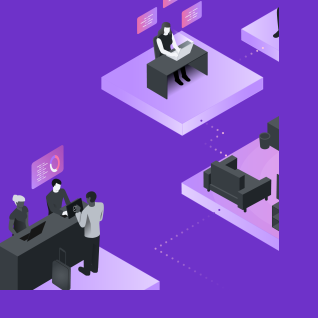
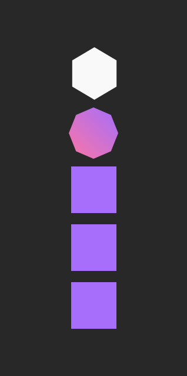

import HomepageTemplate from 'gatsby-theme-carbon/src/templates/Homepage';
import { Column, ImageCard, Row, Video } from "gatsby-theme-carbon";
import './home.scss';

export default HomepageTemplate;

<Row className={"getting-started hide-on-medium"}>
  <Column colMd={4} colLg={4} noGutterSm>
    <ImageCard
      className="card"
      title="Fundamentals"
      href="/fundamentals/"
      aspectRatio="1:1"
      hoverColor="dark"
      titleColor="dark"
      actionIcon="arrowRight"
      iconColor="dark">

  </ImageCard>
  <ImageCard
    className="card"
    title="Basics"
    aspectRatio="1:1"
    href="/basics/ai/"
    hoverColor="dark"
    titleColor="light"
    actionIcon="arrowRight">

  </ImageCard>
</Column>

<Column colMd={4} colLg={4} noGutterSm>
    <ImageCard
      className="card"
      title="Ethics"
      aspectRatio="1:1"
      href="/ethics/"
      hoverColor="dark"
      titleColor="dark"
      actionIcon="arrowRight"
      iconColor="dark">

  </ImageCard>
      <ImageCard
        className="card"
        title="Conversation"
        titleColor="light"
        aspectRatio="1:1"
        href="/conversation/"
        actionIcon="arrowRight"
        hoverColor="dark">

  </ImageCard>
</Column>

<Column colMd={4} colLg={4} noGutterSm>
    <ImageCard
      className="card"
      title="Team Essentials"
      aspectRatio="1:2"
      href="/team-essentials/"
      actionIcon="arrowRight"
      hoverColor="dark">

  </ImageCard>
</Column>
</Row>

<Row className={"getting-started tablet"}>
  <Column colMd={4} colLg={4} noGutterSm>
    <ImageCard
      className="card"
      title="Fundamentals"
      href="/fundamentals/"
      aspectRatio="1:1"
      hoverColor="dark"
      titleColor="dark"
      actionIcon="arrowRight"
      iconColor="dark">

  </ImageCard>

  <ImageCard
    className="card"
    title="Team Essentials"
    aspectRatio="1:2"
    href="/team-essentials/"
    actionIcon="arrowRight"
    hoverColor="dark">

  </ImageCard>

</Column>

<Column colMd={4} colLg={4} noGutterSm>
<ImageCard
className="card"
title="Basics"
aspectRatio="1:1"
href="/basics/ai/"
hoverColor="dark"
titleColor="light"
actionIcon="arrowRight">

</ImageCard>
    <ImageCard
      className="card"
      title="Ethics"
      aspectRatio="1:1"
      href="/ethics/"
      hoverColor="dark"
      titleColor="dark"
      actionIcon="arrowRight"
      iconColor="dark">

  </ImageCard>
      <ImageCard
        className="card"
        title="Conversation"
        titleColor="light"
        aspectRatio="1:1"
        href="/conversation/"
        actionIcon="arrowRight"
        hoverColor="dark">

  </ImageCard>
</Column>
</Row>
