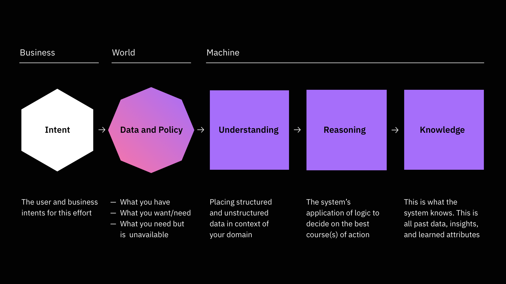

import './team-essentials.scss';

<PageDescription>

  Everyone can play a role in how their team innovates with AI.
Teams need a diverse set of minds and skill sets to create something useful, intuitive, and responsible. These courses will give you the language, knowledge, and actionable methods to work alongside technical and non-technical members of your team to create AI solutions.

</PageDescription>

## Apply design thinking to artificial intelligence.

Teams need a diverse set of minds and skill sets to create something useful, intuitive, and responsible. Our course will give you the language, knowledge, and actionable methods to work alongside technical and non-technical members of your team to create AI solutions.

In this course, you’ll learn our AI Essentials Framework, work through a fictional case study to see how a team could use this framework, and collect resources that you can apply with your team immediately.

You'll explore what it means to design artificial intelligence systems as a team, guided by a clear intent and a focus on people. This course will give you the framework and tools you need to recognize responsible AI design, align your team, and work with data sources to start building an AI solution today.

<Row className={'photo-grid'}>
<Column colMd={5} colLg={8}>
<ImageCard
href="javascript:;"
aspectRatio="16:9">

</ImageCard>
</Column>

<Column colMd={3} colLg={4}>
<ImageCard
aspectRatio="1:1"
href="javascript:;">

</ImageCard>
</Column>

<Column colMd={3} colLg={4}>
<ImageCard
aspectRatio="16:9"
href="javascript:;">

</ImageCard>
</Column>

<Column colMd={5} colLg={8}>
<ImageCard
aspectRatio="16:9"
href="javascript:;">

</ImageCard>
</Column>
</Row>

## AI Essentials Framework

The framework is a set of activities, tools, and principles that enable teams to design thoughtful, human-centered artificial intelligence solutions using Enterprise Design Thinking.

The AI Essentials Framework is a specific grouping of activities to work through to align your team on strategy for an AI experience. There are five focal areas in the framework:

 - **Intent**: Align on the business and user intent(s) for your solution.
 - **Data**: Document the data you could use to make your idea a reality.
 - **Understanding**: Determine what you will need to teach your AI.
 - **Reasoning**: Bring your ideas down to earth.
 - **Knowledge**: Brainstorm the direct and indirect effects of your AI.

<Row>
<Column colLg={12} >

</Column>
</Row>

## Apply design thinking to artificial intelligence.
Throughout this course, you will learn the AI Essentials Framework from experts, see an example in practice, and gather the resources you need to practice on your own project.

<FeatureCard
  className={'feature-card'}
  title="Enterprise Design Thinking for AI"
  actionIcon="launch"
  href="https://www.ibm.com/design/thinking/page/badges/ai"
  color="dark"
  >

</FeatureCard>
